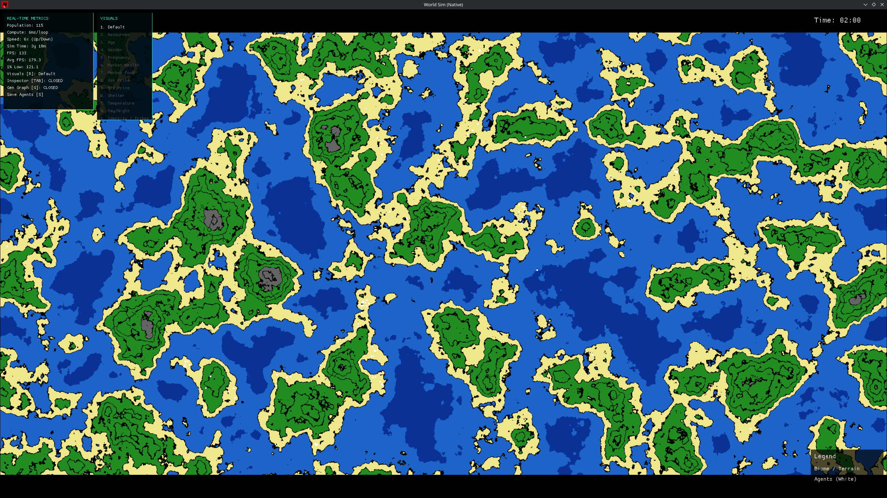
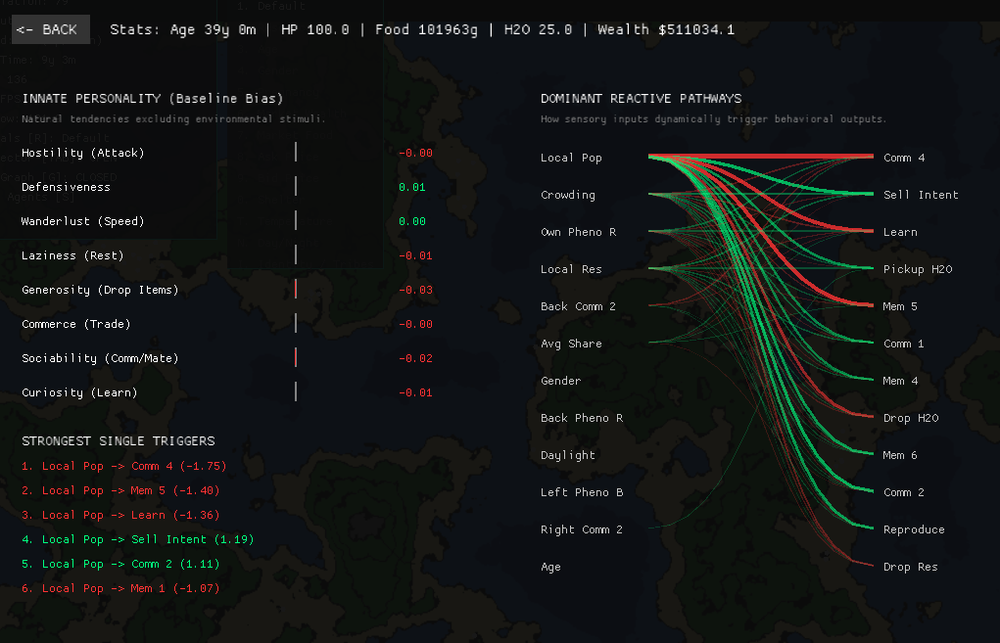
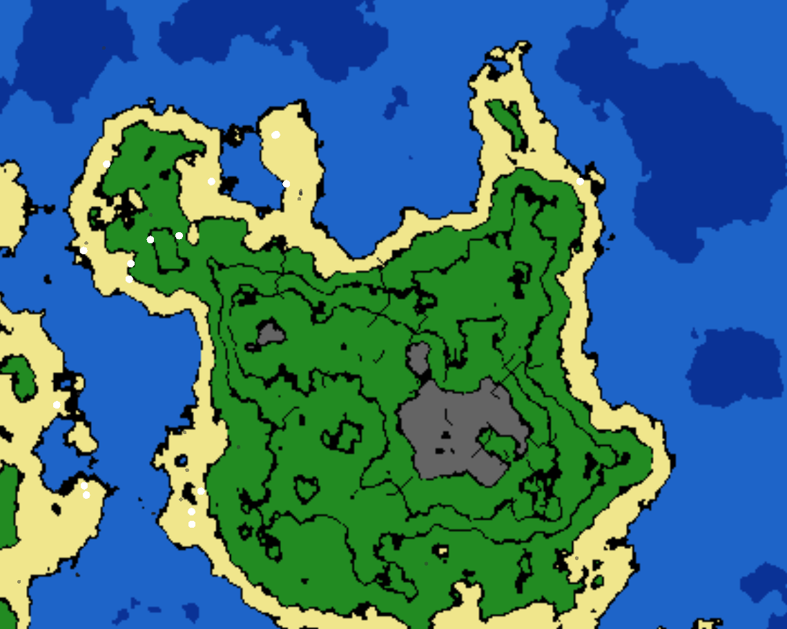
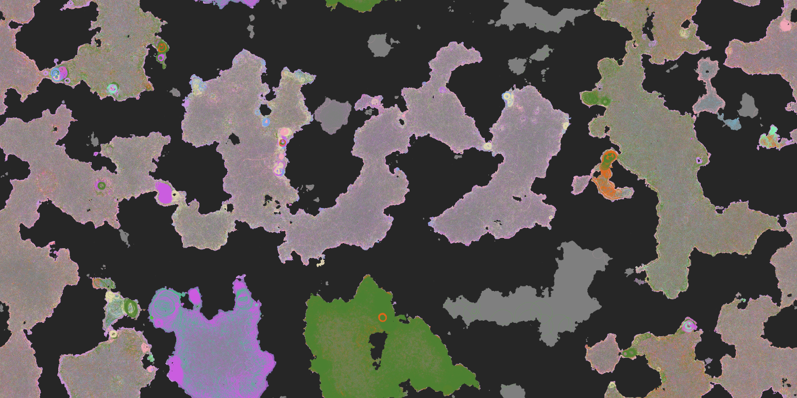
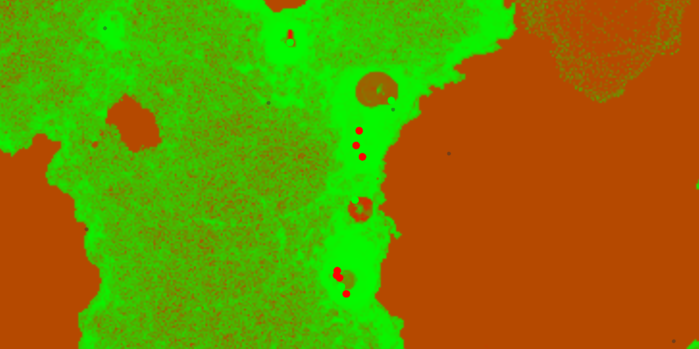
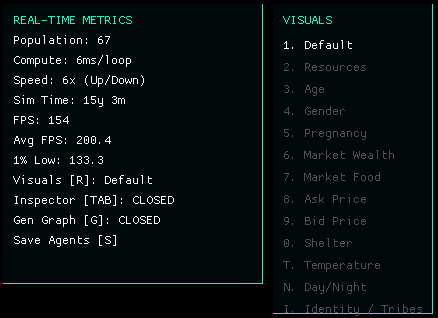
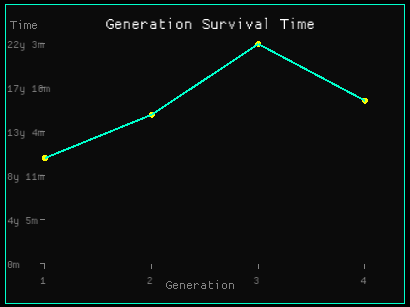

<div align="center">
  <h1>🌍 Grand Sim Pro</h1>
  <p><b>A massively parallel, GPU-accelerated genetic survival simulator.</b></p>
</div>

Grand Sim Pro leverages modern Rust, the `wgpu` graphics API, and Compute Shaders to simulate thousands of autonomous neural-network-driven agents in real-time. 

By offloading the heaviest computational workloads directly to the GPU's VRAM, the engine bypasses traditional CPU bottlenecks, allowing for the simulation of complex ecosystems, terrain physics, and survival mechanics at blistering speeds.



## Architecture

This project uses a highly optimized **Hybrid CPU-GPU Compute Engine**:

- **Library-First Design:** The core simulation logic is encapsulated in a Rust library (`src/lib.rs`), allowing for both the primary binary (`src/main.rs`) and external integration/performance tests to access the engine safely.
- **Decoupled Threading:** The application splits into two entirely independent timelines. The UI thread runs a silky smooth 60 FPS viewport using `macroquad`, while a dedicated background thread dispatches heavy simulation workloads.
- **Lock-Free Responsiveness:** The UI and Simulation threads communicate via an `Arc<Mutex<SharedData>>` using non-blocking `try_lock` patterns and minimized critical sections, ensuring the interface remains responsive even during extreme computational load.
- **WGSL Compute Shaders (`wgpu`):** Instead of looping through agents sequentially on the CPU, the simulation math is written in WebGPU Shading Language (`sim.wgsl`). The GPU executes neural network evaluations, physics calculations, and terrain collisions for every single agent simultaneously.
- **Memory Synchronization:** Structs strictly formatted in memory via `bytemuck` are safely shuttled across the PCIe bus, guaranteeing precise alignment between the Rust CPU state and the WGSL GPU state.

---

## 🧪 Testing & Performance

The project includes a comprehensive suite of unit and integration tests to ensure both behavioral correctness and high-speed execution.

### Unit Tests
To run the standard unit tests (Agent NN logic, Simulation Manager, Environment generation):
```bash
cargo test
```

### Performance Benchmarking
To run the performance suite and log results into `PERFORMANCE_LOG.md`:
```bash
bash scripts/test_perf.sh
```
This script runs benchmarks in **Release mode** to measure:
- **10k Agent Reproduction:** Throughput of genetic crossover and mutation.
- **500 Simulation Steps:** Real-world throughput of the combined CPU/GPU engine with 10,000 active agents.
- **World Generation:** Speed of procedural noise and spherical mapping.

Performance metrics are tracked in `PERFORMANCE_LOG.md` to ensure no code changes introduce regressions.

---

## ✨ Core Features

### 🧠 GPU-Accelerated Neural Networks
<p align="center">
  
</p>

Every agent contains a massive **Deep Neural Network** with two hidden layers (up to 64 nodes each) evaluating **160 distinct sensory inputs** (including Phenotypic Identity, Recurrent Memory, a 3x3 Flattened LiDAR Vision Grid with localized infrastructure detection, Local Market Prices, Encumbrance, Crowding, Health, Food, Age, Gender, and Seasons). The brain evaluates over 6,000 synaptic weights and drives **30 complex output intents** (Turn, Speed, Drop Resource, Reproduce, Attack, Rest, 4 Communication Channels, an active Hebbian Learning intent, 8 Recurrent Memory states, 4 Economic Trading intents, 2 Water Logistics intents, and 4 Infrastructure Construction intents). 

- **Interactive Bipartite Graph:** Hover over any sensory input or behavioral output in the Inspector to instantly isolate and visualize the exact neural pathways driving an agent's current reaction, dynamically dimming all other synaptic noise.
- **Full Influence Heatmap:** A dense 2D matrix visually maps the agent's top 16 most critical sensory inputs against all 31 possible outputs simultaneously, complete with exact synaptic weight tooltips on hover.

### ⚡ In-Lifetime Neuroplasticity & Memory
- **Hebbian Learning Engine:** Agents don't just rely on Darwinian genetics; they can learn on the fly. By firing a specific "Learn Intent" node, an agent triggers an active Hebbian gradient update inside the compute shader, dynamically rewiring its own synaptic weights based on real-time environmental context.
- **Recurrent Memory Loops:** Agents feature 8 dedicated abstract memory channels. What they output to these memory states in one frame is fed directly back into their sensory inputs on the next, allowing them to recall context (like the direction of a shoreline or the location of an attacker).
- **Memory State Visualizer:** The UI features a live array of 8 indicators showing the exact float values (`-1.0` to `1.0`) of an agent's recurrent memory channels, letting you literally watch them "think" and hold context in real-time.
- **Sleep State & Dreaming:** When an agent rests or passes out from exhaustion, they enter a realistic sleep state. Voluntary motor functions (movement, attacking, trading) are physically paralyzed, and vision drops to 10%, but hearing and memory channels remain fully active. Because the Hebbian learning intent can remain active, agents can literally *dream*—consolidating memories and updating synapses while asleep!

### 🎨 Dedicated GPU Rendering Pipeline
Instead of downloading the entire 165MB+ map state back to the CPU every frame, the simulation features a dedicated `render_main` Compute Shader. The GPU directly translates millions of `CellState` structs into packed RGBA pixel data entirely in VRAM. The CPU only fetches the final compressed 8MB frame, massively alleviating PCIe bandwidth bottlenecks and allowing for ultra-widescreen, densely populated procedural maps.
- **2.5D Directional Shading:** The compute shader dynamically calculates elevation slopes to cast realistic topographical shadows across mountains and valleys, giving the 2D grid a breathtaking 3D illusion with zero performance penalty!

### 🌍 Procedural Continents & Spherical Projection
<p align="center">
  
</p>

The environment is generated using Fractal Brownian Motion (FBM) layered over Perlin noise. 
- **Spherical Mapping & Continents:** 2D map coordinates are mapped to a mathematically perfect 3D spherical projection. The map naturally generates massive continental landmasses with distinct, freezing North and South poles. If an agent walks directly over a pole, their longitude shifts 180 degrees seamlessly!
- **Dynamic Biomes:** A secondary moisture noise layer interacts with global latitude temperatures to organically paint diverse biomes: Snow, Tundra, Deserts, Savannas, Jungles, and Forests.
- **Topological Contours:** The generator extracts exact heightmap elevations and visualizes them using dynamic contour lines on the rendered texture.

### 🗺️ Pheromone Grid, Spatial Awareness & Communication
<p align="center">
  
</p>

The map doesn't just store resources—it acts as a biological grid. As agents traverse the tiles, they leave behind continuously decaying "pheromone" traces of their speed, community-sharing intent, aggression, and pregnancy status.
- **Pseudo-Communication:** Agents feature 4 dedicated abstract output channels (`comm1..4`). These signals mix directly into the tile's pheromones, which are then read by neighboring agents on the next frame. The neural networks must autonomously figure out how to invent and decode their own localized languages!
- **Emergent Tribal Identity (Phenotypes):** Agents possess inheritable and mutating phenotypic markers (represented as an RGB color). They constantly emit this phenotype into the ground. Agents can sense their own phenotype and compare it to the scent of the local tile and their neighbors, naturally evolving Kin Selection (e.g., "Cooperate with those who smell like me, attack those who don't") without any hardcoded "Friend/Enemy" logic!

### 💹 Localized AMM Economies & Trade
<p align="center">
  
</p>

The simulation implements an Automated Market Maker (AMM) style liquidity pool on every single tile, separating physical **Food** from weightless **Wealth** (USD).
- **Micro-Economies:** Agents read the local `Ask` and `Bid` prices of the cell they stand on, and can output their own intended prices alongside a `Buy` or `Sell` intent.
- **Food Spoilage:** Physical organic food rots over time (accelerated by warm temperatures), limiting how much can be passively hoarded.
- **Capitalism & Survival:** Because hoarding physical food causes encumbrance and inevitably rots, agents are organically incentivized to invent commerce—farming food, carrying it to a profitable market tile, selling it for weightless, non-perishable USD, and using that Wealth to pay for life-extending healthcare, boat travel, or reproduction.

### 🏗️ Civilization & Infrastructure
Agents can expend wealth to construct mutually exclusive infrastructure on tiles: **Roads, Houses, Farms, and Granaries**.
- These structures grant massive survival bonuses (e.g., 2x movement speed on roads, highly efficient sleep in houses, or 90% rot reduction in granaries).
- **Decay & Maintenance:** Infrastructure is subjected to realistic weathering and active wear-and-tear from population usage. Heavily trafficked roads and actively farmed land will decay over time, requiring continuous economic maintenance.

### ⛰️ Advanced Terrain Physics & Resource Mechanics
Agents do not just walk freely; the environment fights back.
- **Elevation & Biome Survival:** Agents evaluate the topographical slope of the terrain. Walking uphill severely slows movement. Resources organically scale with biomes—deserts and snow caps are biologically barren (producing 1% to 5% baseline resources), forcing populations to migrate to lush equatorial jungles or invent agriculture to terraform the land!
- **Longitude Convergence:** To accurately simulate a 3D globe on a flat 2D memory array, the physics engine mathematically stretches horizontal movement and LiDAR vision at the poles. Agents can traverse the extreme north and south edges up to 6.6x faster, seamlessly matching spherical trigonometry.
- **Hydration & Satiation:** Biological needs are strictly mapped to real-world metrics (Grams of Food, Kg of Water). Coastlines provide baseline water, but tiles themselves possess dynamic water storage capacities. Agents use Neural Network intents to explicitly pick up or drop water into local tiles, effectively allowing them to build inland reservoirs.
- **Water Obstacles:** Rivers, lakes, and oceans are physical obstacles. They are impassable unless an agent has gathered enough wealth to overcome the "boat threshold," forcing populations to build around natural water formations or pay for transit.
- **Encumbrance & Crowding:** Inventory represents physical mass. Carrying large amounts of food and water severely encumbers agents, slowing their movement speed. Additionally, high populations on a single tile create a physical crowding penalty, organically forcing herds to spread out.

### 🧬 Biological Lifecycle & Genetics
Agents are subject to the harsh realities of life mapped to a realistic timeline (Years/Months). They constantly burn baseline calories to survive, and running depletes Stamina, forcing them to rest. If they run out of resources, they will starve and eventually die. 
- **Combat & Parasitism:** Agents can evolve to output an "Attack" intent, actively stealing food from abstract populations on their current tile, simulating predator/prey dynamics.
- **Sexual Reproduction & Gestation:** Agents possess a male/female gender and must reach puberty to mate. If a healthy Male and Female mate, the female becomes pregnant, entering a Gestation period where she moves slower and consumes significantly more food/water before birthing the genetically crossed child.
- **Extinction Founder System & Map Regeneration:** If an entire generation goes extinct, the simulation doesn't just throw away the progress. It extracts the longest-surviving "Founders" (configurable, e.g., top 100) and procedurally generates an entirely **new global map**. It then repopulates the new world with mutated descendants and a configurable percentage of entirely random agents, clustering them into "tribes" on viable land.

### 💾 Neural Network Serialization (Save/Load)
- **Snapshot Evolution:** If you observe an incredibly successful ecosystem, press `S` to instantly serialize and save the complex internal weights of the top currently living agents into JSON format (`saved_agents_weights/`).
- **Pre-seeded Founders:** Set `load_saved_agents_on_start: 1` in the configuration to inject these highly evolved brains into a completely fresh simulation at boot, effectively transferring knowledge across independent runs.

### ⚙️ Live Configuration Panel & `sim_config.json`
On its first run, the simulation generates a `sim_config.json` file, mapping the environment to realistic metrics (e.g., 1 Resource = $1 USD, 1 Tick = 1 Minute).

Press **C** to open the in-game Live Configuration Panel. You can freely tweak over 50 physical parameters dynamically in real-time without recompiling the project or restarting the simulation—including base speeds, climbing penalties, boat costs, combat damage multipliers, pregnancy encumbrance, and infrastructure decay rates!
Modifications can be saved directly back to the `sim_config.json` file via the UI.

### 📊 Real-Time Telemetry
<p align="center">
  
  &nbsp;
  
</p>

The `macroquad` UI tracks engine performance precisely, displaying:
- Live Population Counts
- Compute Latency (ms per loop)
- Dynamic Simulation Speed Multipliers
- Formatted Biological Timeline
- Generational Survival Line Graph (Press G to evaluate population learning trends)
- Average FPS & 1% Lows 

---

## 💻 Prerequisites

To build and run this project natively on your machine, you need:
- Rust
- A Vulkan/Metal/DX12 compatible graphics card (AMD, NVIDIA, or Apple Silicon)

*(Note: If running on Linux via a sandboxed environment like Flatpak, ensure you have exposed X11/Wayland display permissions).*

---

## 🚀 Running the Simulation

Because the simulation runs as a native application, you can compile and launch it with full optimizations using a single command:

```bash
cargo run --release
```

### Controls

- **Mouse Left Click & Drag:** Pan the camera
- **Mouse Scroll Wheel:** Zoom in and out (when Inspector is closed)
- **Spacebar:** Pause / Resume the simulation
- **S Key:** Save the neural network weights of the top living agents to the `saved_agents_weights` directory
- **G Key:** Toggle the Generational Survival Graph to track evolutionary progress over time
- **C Key:** Toggle the Live Configuration Panel to dynamically tweak physics and simulation parameters
- **R Key:** Open Visuals Panel to toggle map views (Resources, Market Prices, Age, Gender, Pregnancy overlays)
- **T Key:** Toggle Temperature map visualization
- **N Key:** Toggle Day/Night shadow visualization
- **I Key:** Toggle Identity / Tribes visual mode to see emergent phenotypic borders
- **W Key:** Toggle Drinkable Water map visualization
- **TAB Key:** Open the Live Inspector. Click an agent's row to inspect its live Neural Network Heatmap, or click `[Locate]` to lock the camera and open the side-panel Agent Tracker.
- **Up Arrow:** Exponentially increase simulation speed (compute loops per frame)
- **Down Arrow:** Exponentially decrease simulation speed

## Dependencies

* `macroquad` - Hardware-accelerated 2D UI and input handling
* `wgpu` - Safe, cross-platform graphics and compute API (Vulkan backend)
* `bytemuck` - Raw memory casting for CPU-to-GPU structuring
* `noise` - Procedural 4D terrain generation
* `rand` - Mathematical RNG utilities
* `pollster` - Synchronous blocking for GPU initialization

## Citation & Academic Use

This project is an independent research initiative exploring neural plasticity and evolutionary dynamics in GPU-accelerated environments.

If you utilize this engine, its neural architecture, or the simulation logic in an academic or professional capacity, please cite the work as follows:

Suthar, V. H. (2026). Grand Sim Pro: A GPGPU Framework for Evolutionary Agent-Based Modeling. GitHub Repository. https://github.com/GoVed/grand-sim-pro

## AI Assistance Acknowledgment

In accordance with emerging standards for transparency in software development and academic research:

This project was developed with the assistance of Google's Gemini AI for code generation, refactoring, and architectural brainstorming. All AI-generated outputs were rigorously reviewed, tested, and guided by the human author to ensure strict GPU memory alignment, computational accuracy, and alignment with the project's core research objectives. The author assumes full responsibility for the final codebase, architecture, and simulation logic.